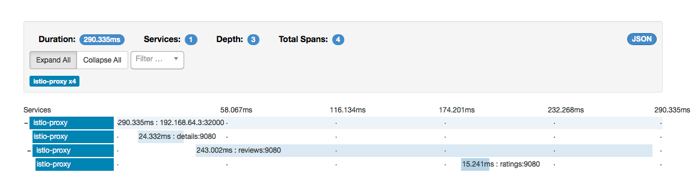



This task shows you how to configure [Istio proxy](https://github.com/istio/proxy) and related components to collect trace spans using [Zipkin](http://zipkin.io). After completing this task, you should understand all of the assumptions about your application and how to have it participate in tracing, regardless of what language/framework/platform you use to build your application.


The [BooiInfo]({{home}}/docs/samples/bookinfo.html) sample application is used as the example application throughout this task.

## Before you begin

To use the Zipkin implementation, we'll need to do the following pre-work:

* Install the Zipkin service
* Configure Istio components to use Zipkin 


These steps are intended to be run when you install Istio's core components. Please see the [task for installing Istio]({{home}}/docs/tasks/installing-istio.html)

#### Install the Zipkin service

First, let's install the Zipkin service so that our components/proxies can send span data to it. 

1. If you're not already in this directory, change directories to `install/kubernetes`

    ```bash
    cd install/kubernetes
    ```
    
2. Apply the zipkin yaml resource files

    ```bash
    kubectl apply -f addons/zipkin.yaml
    ```
    
You can contine to install the `addons` as instructed in the [task for installing Istio]({{home}}/docs/tasks/installing-istio.html)

#### Configure Istio components to use Zipkin 

In step 4 of [Installing Istio]({{home}}/docs/tasks/installing-istio.html), we try to apply the `istio.yaml` file which contains the core components of Istio.

Note: When we install the components for using Zipkin, we will not treat the RBAC scenarios; these steps work when RBAC is NOT enabled for your Kubernetes cluster.

Observe that when we are installing the core Istio components, that we're configuring the manager's discovery service to find Zipkin running at `zipkin:9411`. That means when the manager configures proxies, they'll know to send spans to that configured location:

```yaml
# Manager service for discovery
apiVersion: v1
kind: ConfigMap
metadata:
  name: istio
data:
  mesh: |-
    mixerAddress: istio-mixer:9091
    discoveryAddress: istio-manager:8080
    ingressService: istio-ingress
    zipkinAddress: zipkin:9411
```

When you've completed installing the Zipkin service (from above) and step 4 of [Installing Istio]({{home}}/docs/tasks/installing-istio.html), you should be ready to test out the Zipkin dashboard. First, locate the URL (if using an public IP) or try doing a port-forward with the `kubectl` client:


```bash
kubectl port-forward $(kubectl get pod -l app=zipkin -o jsonpath='{.items[0].metadata.name}') 9411:9411
```

Then open your browser at [http://localhost:9411](http://localhost:9411)


## Setting up the Bookinfo Sample

Now that Zipkin is running and the Istio components are configured to make the proxies Zipkin-aware, we need to [install the Bookinfo sample]({{home}}/docs/samples/bookinfo.html) demo. Please review the [installation steps for Bookinfo]({{home}}/docs/samples/bookinfo.html). Feel free to continue on with the demo, invoking the productpage website, and observe the span information in the Zipkin console. You should see something similar to this output:


If you click into a trace you should see the following:



## Understanding What Happened

Although the proxies are able to automatically send spans to Zipkin, they'll need some hints to tie together the entire trace. We'll need to propogate the appropriate HTTP headers so that when the proxies send span information to Zipkin, the spans can be correlated correctly into a single trace.

To do this, our application needs to collect and propogate the following headers from the incoming request to any outgoing requests:

* `x-request-id`
* `x-b3-traceid`
* `x-b3-spanid`
* `x-b3-parentspanid`
* `x-b3-sampled`
* `x-b3-flags`
* `x-ot-span-context`

If you look in the sample applications, you can see that the product-age application (Python) extracts the required headers from an HTTP request:

```python
def getForwardHeaders(request):
    headers = {}

    user_cookie = request.cookies.get("user")
    if user_cookie:
        headers['Cookie'] = 'user=' + user_cookie

    incoming_headers = [ 'x-request-id',
                         'x-b3-traceid',
                         'x-b3-spanid',
                         'x-b3-parentspanid',
                         'x-b3-sampled',
                         'x-b3-flags',
                         'x-ot-span-context'
    ]

    for ihdr in incoming_headers:
        val = request.headers.get(ihdr)
        if val is not None:
            headers[ihdr] = val
            #print "incoming: "+ihdr+":"+val

    return headers
```

The reviews application (Java) does something similar:
 
```java
    @GET
    @Path("/reviews")
    public Response bookReviews(@CookieParam("user") Cookie user,
                                @HeaderParam("x-request-id") String xreq,
                                @HeaderParam("x-b3-traceid") String xtraceid,
                                @HeaderParam("x-b3-spanid") String xspanid,
                                @HeaderParam("x-b3-parentspanid") String xparentspanid,
                                @HeaderParam("x-b3-sampled") String xsampled,
                                @HeaderParam("x-b3-flags") String xflags,
                                @HeaderParam("x-ot-span-context") String xotspan) {
      String r1 = "";
      String r2 = "";

      if(ratings_enabled){
        JsonObject ratings = getRatings(user, xreq, xtraceid, xspanid, xparentspanid, xsampled, xflags, xotspan);
``` 


When you make downstream calls, make sure to include those headers.

## What's next

* Learn more about [Metrics and Logs]({{home}}/docs/tasks/metrics-logs.html)

* Learn more about [Mixer]({{home}}/docs/concepts/policy-and-control/mixer.html) and [Mixer Config]({{home}}/docs/concepts/policy-and-control/mixer-config.html).

* Discover the full [Attribute Vocabulary]({{home}}/docs/reference/config/mixer/attribute-vocabulary.html).

* Read the reference guide to [Writing Config]({{home}}/docs/reference/writing-config.html).

* If you are not planning to explore any follow-on tasks, refer to the
  [BookInfo cleanup]({{home}}/docs/samples/bookinfo.html#cleanup) instructions
  to shutdown the application and cleanup the associated rules.
